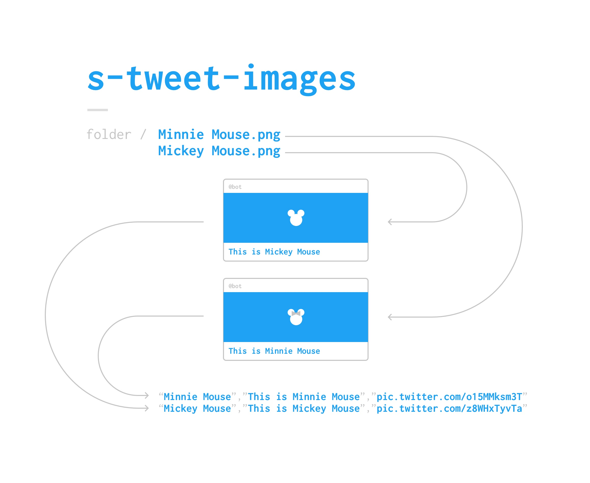

### About
s-tweet-images is a script with iterates through an directory of images and tweets every single one of them. 
It also stores for every sent tweet the text, an ID and the publicly displayed url of the tweeted image (This is useful to [create](https://onlinejournalismblog.com/2015/02/11/how-to-make-a-tweetable-image-in-your-blog-post/) 'Tweet this Image'-buttons)

## Install
Run `npm install` (in Terminal)

### How to run
3. Open `Terminal` on your Mac (or the equivalent on your OS)
4. In Terminal, navigate to the folder you want to iterate through
5. Enter the command `node path/to/index.js` (you can drag and drop the javascript file into the terminal to get its path or you just put it where it should be run)
6. Done – all your images are now tweeted

### Image Sources
Example images taken from [Giphy](http://giphy.com/search/mickey-mouse)

### Cost (License)
0 € – it's **public domain**